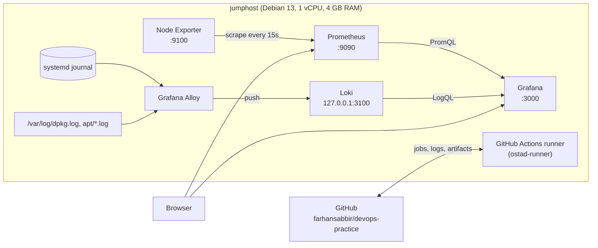
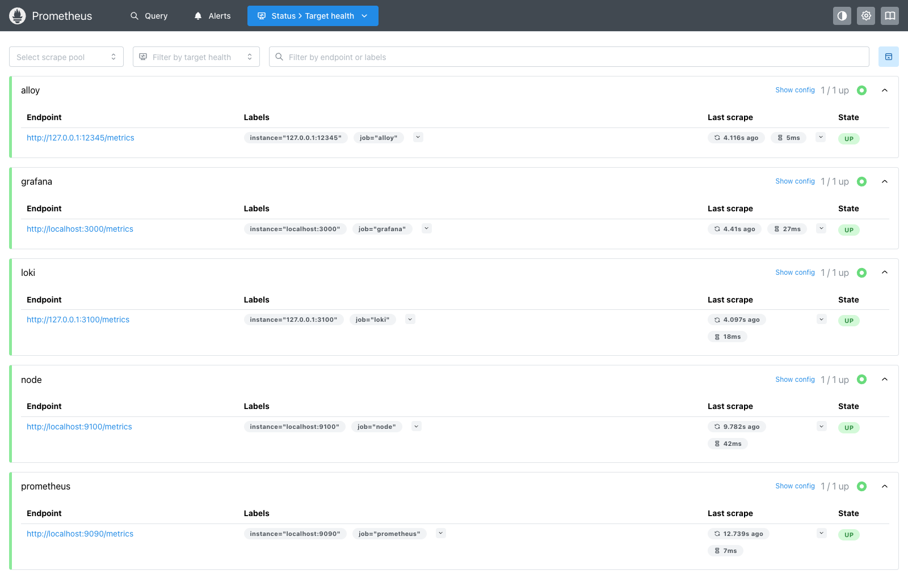
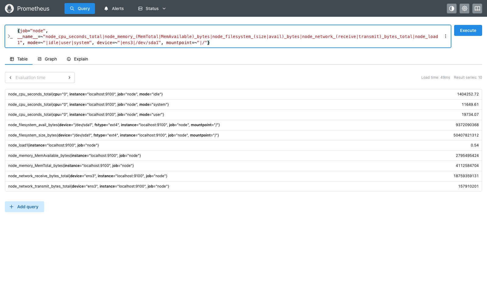
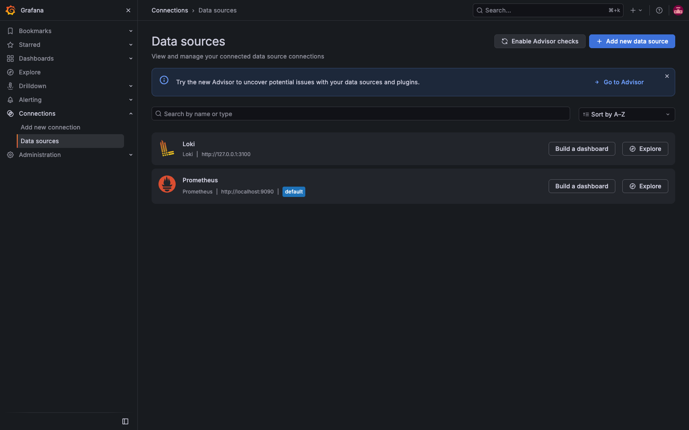
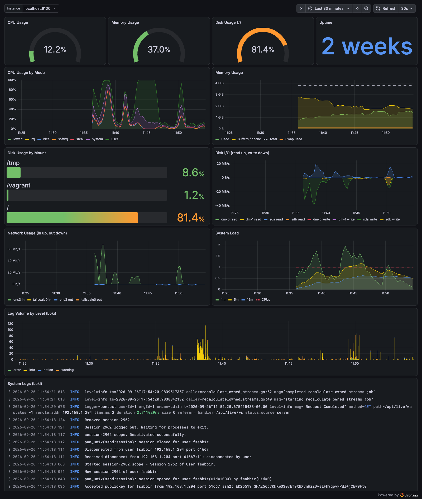
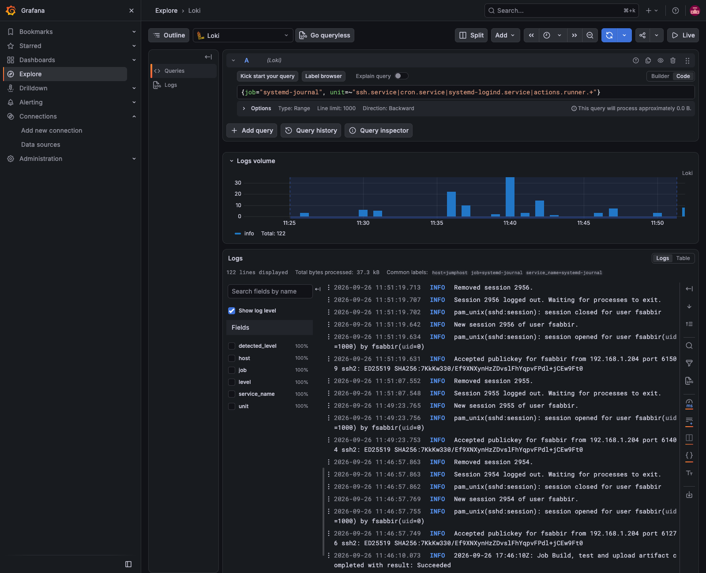
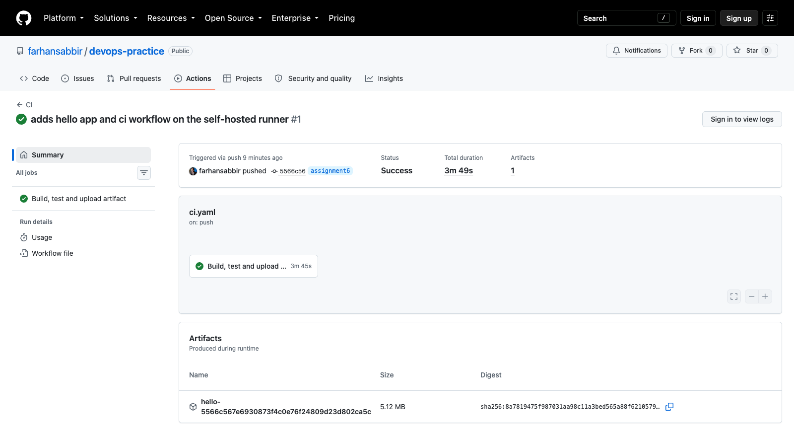

# Assignment 6 — Monitoring, Logging and CI on a Self-Hosted Server

## Farhan Sabbir Siddique
### Batch: DevOps Batch 14

In this assignment I set up a basic DevOps environment on my own server (my jumphost):

- **Prometheus** and **Node Exporter** for system metrics (CPU, memory, disk, network)
- **Grafana** with a monitoring dashboard on top of Prometheus
- **Loki** for logs, fed by **Grafana Alloy**, and shown in Grafana
- A **GitHub Actions CI pipeline** that runs on a **self-hosted runner** on the same server: build, test, and upload the build output as an artifact

Prometheus, Node Exporter and Loki are installed by hand from their official release binaries, each running as its own systemd service with its own system user. Grafana and Alloy come from Grafana Labs' official APT repository. No Docker is used anywhere.

> The assignment targets Ubuntu. My server runs **Debian 13 (trixie)**, which Ubuntu is built on. Everything here uses only `apt`, `systemd` and upstream release binaries, so the same steps apply to Ubuntu 22.04/24.04.

## Contents

- [Architecture](#architecture)
- [Repository layout](#repository-layout)
- [Versions, ports and services](#versions-ports-and-services)
- [Setup instructions](#setup-instructions)
  - [1. Node Exporter](#1-node-exporter)
  - [2. Prometheus](#2-prometheus)
  - [3. Loki and Alloy](#3-loki-and-alloy)
  - [4. Grafana, datasources and dashboard](#4-grafana-datasources-and-dashboard)
  - [5. Firewall](#5-firewall)
  - [6. GitHub Actions CI on a self-hosted runner](#6-github-actions-ci-on-a-self-hosted-runner)
- [The dashboard](#the-dashboard)
- [Verification](#verification)
- [Screenshots](#screenshots)
- [Design notes](#design-notes)
- [Requirements checklist](#requirements-checklist)

## Architecture



## Repository layout

| Path | What it is |
|---|---|
| [`prometheus/prometheus.yml`](prometheus/prometheus.yml) | Prometheus configuration — scrapes Node Exporter (and Prometheus, Grafana, Loki, Alloy) |
| [`prometheus/prometheus.service`](prometheus/prometheus.service) | systemd unit for Prometheus |
| [`node_exporter/node_exporter.service`](node_exporter/node_exporter.service) | systemd unit for Node Exporter |
| [`loki/loki-config.yaml`](loki/loki-config.yaml) | Loki configuration (single binary, filesystem storage, 7-day retention) |
| [`loki/loki.service`](loki/loki.service) | systemd unit for Loki |
| [`alloy/config.alloy`](alloy/config.alloy) | Grafana Alloy pipeline: journal + `/var/log` files → Loki |
| [`grafana/provisioning/datasources/datasources.yaml`](grafana/provisioning/datasources/datasources.yaml) | Prometheus and Loki datasources |
| [`grafana/provisioning/dashboards/dashboards.yaml`](grafana/provisioning/dashboards/dashboards.yaml) | Tells Grafana to load dashboards from disk |
| [`grafana/dashboards/node-overview.json`](grafana/dashboards/node-overview.json) | The monitoring dashboard |
| [`scripts/`](scripts/) | Install scripts, one per component (what I ran on the server) |
| [`app/`](app/) | A small Go HTTP service that the CI pipeline builds, tests and packages |
| [`.github/workflows/ci.yaml`](.github/workflows/ci.yaml) | The GitHub Actions workflow |
| [`screenshots/`](screenshots/) | Screenshots of everything running |

## Versions, ports and services

| Component | Version | Installed from | Listens on | systemd unit | Runs as |
|---|---|---|---|---|---|
| Node Exporter | 1.12.1 | GitHub release tarball | `0.0.0.0:9100` (firewalled) | `node_exporter.service` | `node_exporter` |
| Prometheus | 3.15.0 | GitHub release tarball | `0.0.0.0:9090` | `prometheus.service` | `prometheus` |
| Loki | 3.7.8 | GitHub release zip | `127.0.0.1:3100`, gRPC `127.0.0.1:9096` | `loki.service` | `loki` |
| Grafana Alloy | 1.20.0 | apt.grafana.com | `127.0.0.1:12345` | `alloy.service` | `alloy` |
| Grafana | 13.2.2 | apt.grafana.com | `0.0.0.0:3000` | `grafana-server.service` | `grafana` |
| GitHub Actions runner | 2.337.0 | GitHub release tarball | outbound only | `actions.runner.farhansabbir-devops-practice.ostad-runner.service` | `fsabbir` |

## Setup instructions

All commands run on the server. Clone this branch first:

```bash
git clone -b assignment6 https://github.com/farhansabbir/devops-practice.git
cd devops-practice
```

Each script under `scripts/` does one component and can be re-run safely: it downloads the pinned version, **verifies the SHA-256 checksum published with the release**, installs the binary and config, and (re)starts the service. Versions can be overridden with an environment variable (for example `sudo PROMETHEUS_VERSION=3.15.0 ./scripts/install-prometheus.sh`).

### 1. Node Exporter

```bash
sudo ./scripts/install-node-exporter.sh
```

What it does, step by step:

```bash
V=1.12.1
curl -fsSLO https://github.com/prometheus/node_exporter/releases/download/v$V/node_exporter-$V.linux-amd64.tar.gz
curl -fsSLO https://github.com/prometheus/node_exporter/releases/download/v$V/sha256sums.txt
grep " node_exporter-$V.linux-amd64.tar.gz$" sha256sums.txt | sha256sum -c -
tar -xzf node_exporter-$V.linux-amd64.tar.gz

sudo useradd --system --no-create-home --shell /usr/sbin/nologin node_exporter
sudo install -m 0755 node_exporter-$V.linux-amd64/node_exporter /usr/local/bin/
sudo install -m 0644 node_exporter/node_exporter.service /etc/systemd/system/
sudo systemctl daemon-reload
sudo systemctl enable --now node_exporter
```

Check that the metrics are exposed (CPU, memory, disk, network):

```bash
curl -s localhost:9100/metrics | grep -E '^node_(cpu_seconds_total\{cpu="0",mode="idle"|memory_MemAvailable_bytes|filesystem_avail_bytes\{.*mountpoint="/"\}|network_receive_bytes_total\{device="ens3")'
```
```text
node_cpu_seconds_total{cpu="0",mode="idle"} 1.40382442e+06
node_filesystem_avail_bytes{device="/dev/sda1",device_error="",fstype="ext4",mountpoint="/"} 1.2804947968e+10
node_memory_MemAvailable_bytes 3.326595072e+09
node_network_receive_bytes_total{device="ens3"} 1.7614042012e+10
```

### 2. Prometheus

```bash
sudo ./scripts/install-prometheus.sh
```

Same pattern as Node Exporter — download and verify the release, then:

```bash
sudo useradd --system --no-create-home --shell /usr/sbin/nologin prometheus
sudo install -m 0755 prometheus-$V.linux-amd64/{prometheus,promtool} /usr/local/bin/
sudo install -d -o prometheus -g prometheus /etc/prometheus /var/lib/prometheus
sudo install -o prometheus -g prometheus -m 0644 prometheus/prometheus.yml /etc/prometheus/
promtool check config /etc/prometheus/prometheus.yml
sudo install -m 0644 prometheus/prometheus.service /etc/systemd/system/
sudo systemctl daemon-reload
sudo systemctl enable --now prometheus
```

The scrape configuration for Node Exporter ([`prometheus/prometheus.yml`](prometheus/prometheus.yml)):

```yaml
global:
  scrape_interval: 15s

scrape_configs:
  - job_name: node
    static_configs:
      - targets: ["localhost:9100"]
```

The same file also scrapes Prometheus itself, Grafana, Loki and Alloy, so the whole stack is monitored. The systemd unit caps storage at **15 days or 2 GB**, whichever comes first, because the disk is shared with other work.

Check that the Node Exporter target is **UP**:

```bash
curl -s localhost:9090/api/v1/targets | python3 -c 'import json,sys; [print(t["labels"]["job"], t["scrapeUrl"], t["health"]) for t in json.load(sys.stdin)["data"]["activeTargets"]]'
```
```text
alloy http://127.0.0.1:12345/metrics up
grafana http://localhost:3000/metrics up
loki http://127.0.0.1:3100/metrics up
node http://localhost:9100/metrics up
prometheus http://localhost:9090/metrics up
```

Or in the browser: `http://<server>:9090/targets` (see [screenshot](#screenshots)).

### 3. Loki and Alloy

```bash
sudo ./scripts/install-loki.sh
```

**Loki** is installed by hand like Prometheus: the `loki-linux-amd64.zip` release, checksum verified, a `loki` system user, [`/etc/loki/loki-config.yaml`](loki/loki-config.yaml) (checked with `loki -verify-config`), data in `/var/lib/loki` and [`loki.service`](loki/loki.service). Main points of the config:

- single binary mode, local filesystem storage, TSDB index (schema v13)
- `auth_enabled: false` — so it **listens on 127.0.0.1 only**; Grafana and Alloy are on the same machine
- 7-day retention, enforced by the compactor

Loki doesn't collect logs itself, so something has to send them. I used **Grafana Alloy** (Promtail, the older agent, reached end of life in 2026). The script adds Grafana's APT repository, installs `alloy`, adds the `alloy` user to the `systemd-journal` and `adm` groups so it can read logs, and installs [`alloy/config.alloy`](alloy/config.alloy):

- **systemd journal** → labels `job="systemd-journal"`, `unit` (the service) and `level` (the priority)
- **`/var/log/*.log` and `/var/log/apt/*.log`** → `job="varlogs"`, but not rsyslog's copies of the journal (`auth.log`, `kern.log`, `ufw.log`, ...), which would only duplicate it
- a filter that drops `[UFW AUDIT]` kernel lines: my firewall logs at level *high*, which writes one line for every allowed packet, including Loki's own loopback traffic (logging it would feed back into Loki)

Check that Loki is ready and logs arrive:

```bash
curl -s 127.0.0.1:3100/ready
logger -t assignment6 "hello loki from the jumphost"
curl -s -G 127.0.0.1:3100/loki/api/v1/query_range --data-urlencode 'query={job="systemd-journal"} |= "hello loki"'
```
```text
ready
... "stream":{"host":"jumphost","job":"systemd-journal","level":"notice","unit":"session-2943.scope"} ... "hello loki from the jumphost" ...
```

### 4. Grafana, datasources and dashboard

```bash
sudo ./scripts/install-grafana.sh
```

This installs `grafana` from Grafana's APT repository and **provisions** everything from files, so nothing has to be clicked together by hand and the setup is reproducible:

- [`datasources.yaml`](grafana/provisioning/datasources/datasources.yaml) → `/etc/grafana/provisioning/datasources/`: **Prometheus** (`http://localhost:9090`, default) and **Loki** (`http://127.0.0.1:3100`)
- [`dashboards.yaml`](grafana/provisioning/dashboards/dashboards.yaml) → `/etc/grafana/provisioning/dashboards/`: loads JSON dashboards from `/var/lib/grafana/dashboards`
- [`node-overview.json`](grafana/dashboards/node-overview.json) → `/var/lib/grafana/dashboards/`: the dashboard, in the folder *Assignment 6*

Grafana's first login is `admin` / `admin`, and it makes you change the password right away. I changed it and **did not commit it** to this repository.

Check the datasources from the API:

```bash
curl -s -u admin:<password> localhost:3000/api/datasources/uid/prometheus/health
curl -s -u admin:<password> localhost:3000/api/datasources/uid/loki/health
```
```text
{"details":{"application":"Prometheus",...},"message":"Successfully queried the Prometheus API.","status":"OK"}
{"message":"Data source successfully connected.","status":"OK"}
```

Then open `http://<server>:3000` → **Dashboards → Assignment 6 → Jumphost Monitoring (Node Exporter + Loki)**. Logs can also be explored under **Explore → Loki**, for example `{job="systemd-journal", unit="ssh.service"}`.

### 5. Firewall

The server runs `ufw` with incoming traffic denied by default. I opened only the two web UIs:

```bash
sudo ufw allow 3000/tcp comment grafana
sudo ufw allow 9090/tcp comment prometheus
```

Node Exporter (9100) stays closed to the network; Prometheus scrapes it over localhost. Loki and Alloy listen on 127.0.0.1 only.

### 6. GitHub Actions CI on a self-hosted runner

**Registering the runner** (repository → *Settings → Actions → Runners → New self-hosted runner* shows the same commands with a one-time token):

```bash
mkdir ~/actions-runner && cd ~/actions-runner
curl -o actions-runner-linux-x64-2.337.0.tar.gz -L \
  https://github.com/actions/runner/releases/download/v2.337.0/actions-runner-linux-x64-2.337.0.tar.gz
tar xzf actions-runner-linux-x64-2.337.0.tar.gz
./config.sh --url https://github.com/farhansabbir/devops-practice --token <TOKEN> \
  --name ostad-runner --labels ostad-runner --unattended
```

**Running it as a service**, so it survives reboots and doesn't need a terminal open:

```bash
sudo ./svc.sh install fsabbir
sudo ./svc.sh start
```

The runner shows up as `ostad-runner` with labels `self-hosted, Linux, X64, ostad-runner`.

**The workflow** — [`.github/workflows/ci.yaml`](.github/workflows/ci.yaml) — runs on every push to the `assignment6` branch (or manually), on `runs-on: [self-hosted, linux, x64]`, i.e. my server:

| Step | What it does |
|---|---|
| Checkout | `actions/checkout@v7` |
| Set up Go | `actions/setup-go@v7`, Go version taken from `app/go.mod` (1.27) |
| **Build** | `go build -v ./...` |
| **Test** | `go vet ./...`, `go test -v -coverprofile=coverage.out ./...`, coverage summary |
| **Generate artifact** | static `linux/amd64` and `linux/arm64` binaries with the commit SHA baked in as the version, the coverage report, and a `SHA256SUMS` file, in `app/dist/` |
| **Upload artifact** | `actions/upload-artifact@v7` uploads `app/dist/` as `hello-<commit sha>`, kept for 14 days |

The app ([`app/`](app/)) is a small Go HTTP service (`GET /` returns JSON with a greeting, the version and the hostname; `GET /healthz` returns `ok`) with unit tests. There's no deployment step — CD isn't part of this assignment.

A successful run (from the job log):

```text
Runner name: 'ostad-runner'
Machine name: 'linux'
go version go1.27.1 linux/amd64
ok  	github.com/farhansabbir/devops-practice/app	0.007s	coverage: 60.0% of statements
-rwxr-xr-x 1 fsabbir fsabbir 6586528 Sep 26 11:45 hello-linux-amd64
-rwxr-xr-x 1 fsabbir fsabbir 6095008 Sep 26 11:46 hello-linux-arm64
Artifact hello-5566c567e6930873f4c0e76f24809d23d802ca5c has been successfully uploaded! Final size is 5370787 bytes.
```

## The dashboard

*Jumphost Monitoring (Node Exporter + Loki)*, refreshed every 30 s, with an **Instance** selector:

| Panel | Type | Query |
|---|---|---|
| CPU Usage | gauge | `100 * (1 - avg(rate(node_cpu_seconds_total{mode="idle"}[$__rate_interval])))` |
| Memory Usage | gauge | `100 * (1 - node_memory_MemAvailable_bytes / node_memory_MemTotal_bytes)` |
| Disk Usage (/) | gauge | `100 * (1 - node_filesystem_avail_bytes{mountpoint="/"} / node_filesystem_size_bytes{mountpoint="/"})` |
| Uptime | stat | `time() - node_boot_time_seconds` |
| CPU Usage by Mode | stacked time series | `rate(node_cpu_seconds_total{mode!="idle"})` per mode, as % of all CPUs |
| Memory Usage | time series | used (`MemTotal - MemAvailable`), buffers/cache, total, swap used |
| Disk Usage by Mount | bar gauge | % used per real filesystem (tmpfs, overlay etc. excluded) |
| Disk I/O | time series | `rate(node_disk_read_bytes_total)` up, `rate(node_disk_written_bytes_total)` down |
| Network Usage | time series | `rate(node_network_receive_bytes_total) * 8` up, transmit down, in bits/s (virtual interfaces excluded) |
| System Load | time series | `node_load1/5/15` against the number of CPUs |
| Log Volume by Level | bar chart (Loki) | `sum by (level) (count_over_time({job="systemd-journal"}[$__auto]))` |
| System Logs | logs (Loki) | `{job=~"systemd-journal\|varlogs"}` |

(Every Prometheus query is also filtered by `instance="$instance"`.)

## Verification

All services are enabled at boot and running:

```bash
systemctl list-units --type=service node_exporter.service prometheus.service loki.service alloy.service grafana-server.service 'actions.runner.*'
```
```text
actions.runner.farhansabbir-devops-practice.ostad-runner.service loaded active running GitHub Actions Runner (farhansabbir-devops-practice.ostad-runner)
alloy.service                                                    loaded active running Vendor-agnostic OpenTelemetry Collector distribution with programmable pipelines
grafana-server.service                                           loaded active running Grafana instance
loki.service                                                     loaded active running Loki log aggregation system
node_exporter.service                                            loaded active running Prometheus Node Exporter
prometheus.service                                               loaded active running Prometheus monitoring system
```

What listens where:

```bash
sudo ss -ltnp | grep -E ':(9100|9090|3100|9096|3000|12345) '
```
```text
0.0.0.0:3000     grafana
0.0.0.0:9090     prometheus
0.0.0.0:9100     node_exporter
127.0.0.1:12345  alloy
127.0.0.1:3100   loki
127.0.0.1:9096   loki
```

## Screenshots

### Prometheus — all targets UP (Node Exporter is `node`)


### Node Exporter metrics in Prometheus — CPU, memory, disk, network, load


### Grafana — Prometheus and Loki datasources


### Grafana — the monitoring dashboard (CPU, memory, disk, network, and logs from Loki)


### Grafana Explore — logs from Loki (SSH, logind, cron and the Actions runner)


### GitHub Actions — successful run on the self-hosted runner, with the uploaded artifact


## Design notes

- **Prometheus, Node Exporter and Loki each run as their own locked-down system user** (`--system --no-create-home --shell /usr/sbin/nologin`) with a hardened unit (`NoNewPrivileges`, `ProtectSystem=strict`, `ProtectHome`, `PrivateTmp`, write access only to their own data directory). Grafana and Alloy use the units and users their packages ship.
- **Downloads are verified** against each release's published SHA-256 list before anything is installed.
- **Loki has no authentication** in this setup, so it is bound to 127.0.0.1. Only Grafana (3000) and Prometheus (9090) are reachable from the network.
- **The Grafana admin password is not in this repository.**
- **The self-hosted runner and a public repository**: GitHub warns that a public repository's pull requests from forks could run code on a self-hosted runner. The workflow is therefore triggered only by `push` to `assignment6` and by manual runs — never by `pull_request` — and it runs with read-only `contents` permission.
- **Disk**: the server's disk is shared, so Prometheus keeps at most 15 days / 2 GB and Loki 7 days.

## Requirements checklist

| Requirement | Marks | Where |
|---|---|---|
| Prometheus installed manually, systemd service, scraping Node Exporter, target UP | 15 | [step 2](#2-prometheus), [`prometheus/`](prometheus/), screenshot 1 |
| Node Exporter installed manually, systemd service, CPU/RAM/disk/network metrics | 10 | [step 1](#1-node-exporter), [`node_exporter/`](node_exporter/), screenshot 2 |
| Grafana installed, Prometheus datasource, dashboard with CPU, memory, disk, network | 20 | [step 4](#4-grafana-datasources-and-dashboard), [`grafana/`](grafana/), screenshots 3–4 |
| Loki installed and configured, Loki datasource, logs shown in Grafana | 15 | [step 3](#3-loki-and-alloy), [`loki/`](loki/), [`alloy/`](alloy/), screenshots 4–5 |
| GitHub Actions CI on a self-hosted runner: build, test, artifact upload | 25 | [step 6](#6-github-actions-ci-on-a-self-hosted-runner), [`.github/workflows/ci.yaml`](.github/workflows/ci.yaml), [`app/`](app/), screenshot 6 |
| Public repository with README, configs, workflow, setup instructions, screenshots | 15 | this README and the repository |
